# Best practices to backup Salesforce data

## Video 
- How To: Platform: Back Up and Manage Salesforce Data ```click to play```
- [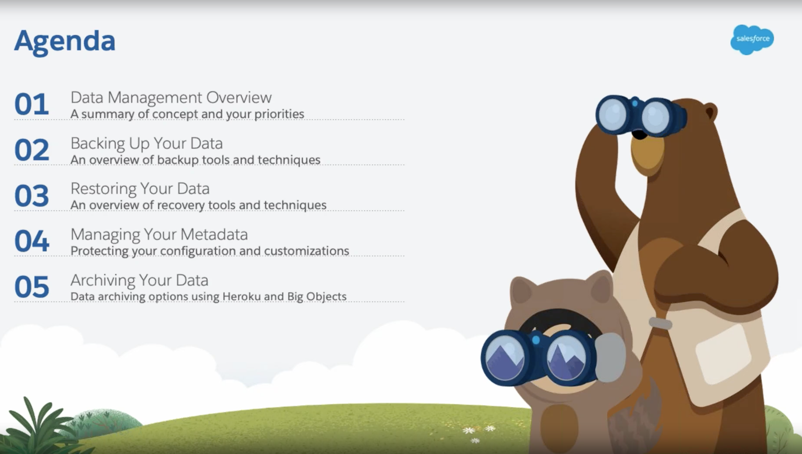](https://salesforce.vidyard.com/watch/epvXNRWrrPHtto735nS2rh?)

## Key message
- Develop a routine data backup strategy as part of their overall data management and security model.  


## Data and metadata

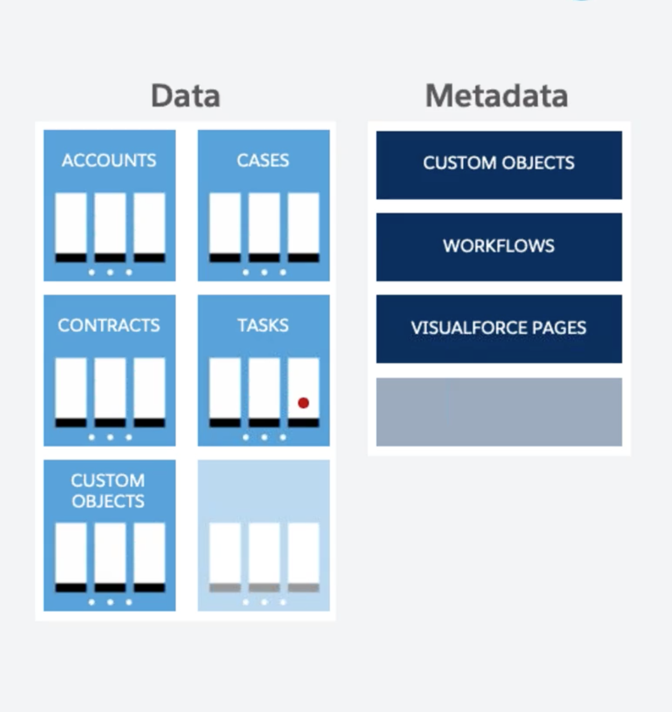

### Data
- Data refers to all of your records, including Accounts, Contacts, Leads, Opportunities, Cases, Contracts, and other records. 
- Data also includes your custom object records, files, content, and Chatter.

### Metadata
- Metadata refers to all of your **configuration settings**, such as 
    - Custom fields, page layouts, 
    - Reports, Dashboards 
    - Custom code like Apex and Visualforce


## About Data Recovery Service
-  As of July 31, 2020, Data Recovery service has been **retired** and no longer available as a service. 


## Need for a restorable backup of the DATA
- Even with the best of intentions, users and administrators have been in situations where they have either **deleted large amounts of data, or have modified records**, only to later realize that a **mistake** was made. 
- With tools like the Data Loader, it is very **easy to mass delete or update records**. 
    - And a simple mistake in your source file or field mapping could spell **disaster** for your data. 
    - It is recommended that you keep a **regular backup of your data** and 
        - Do a manual **point-in-time backup before you proceed with any major data project** within your organization.

## Need for a restorable backup of the METADATA
- It is easy for the administrators or developers, and users with advanced permissions, to make changes to:
    -  your configuration settings, 
        - such as adding or deleting custom fields, 
            - modifying page layouts, 
            - deleting or changing Reports and Dashboards, 
            - modifying custom code. 
- As many of these changes are not reversible, it is important to have a copy of your metadata to fall back on in the event that you need to restore prior settings.


## Restoring the data
- Tools like the **Data Loader and the API** can be used  as a method for customers to manually restore their data.
- It is important to note the **order** in which data is restored to preserve
    - relationships and the connection to related records 
- **Salesforce Services or a partner to assist**  in the restoration of the data, provided you  have a *copy of that data available*.


## Backup and Recovery Offerings
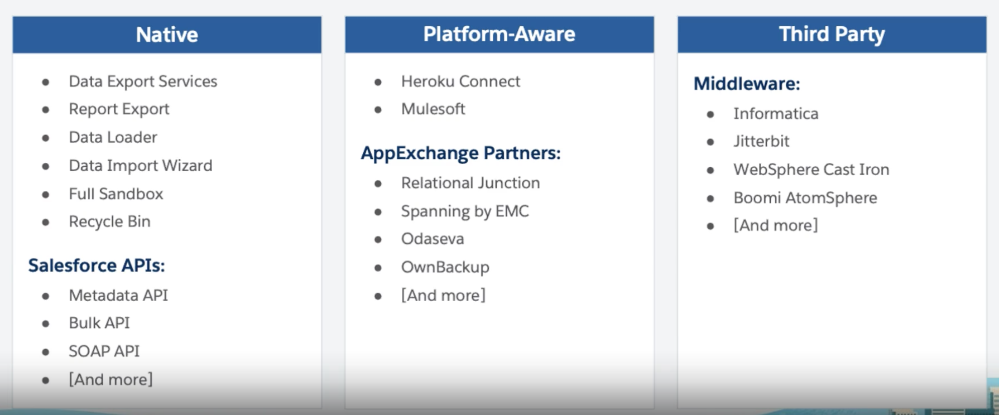

## Native Options for backing up the data
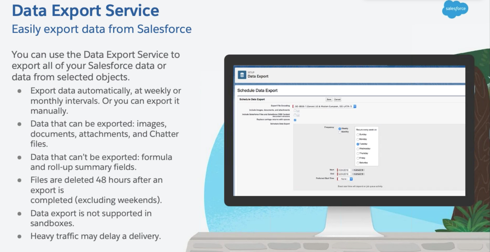
- [Export Backup Data from Salesforce UI](https://help.salesforce.com/articleView?id=sf.admin_exportdata.htm&type=5)

- Not supported features:
    - Formula fields
    - Rollup Summary

- [Manual: Export data using Dataloader](https://help.salesforce.com/articleView?id=sf.exporting_data.htm&type=5)
- [Manual on-demand exports of your data via reports](https://help.salesforce.com/articleView?id=sf.reports_export.htm&type=5)
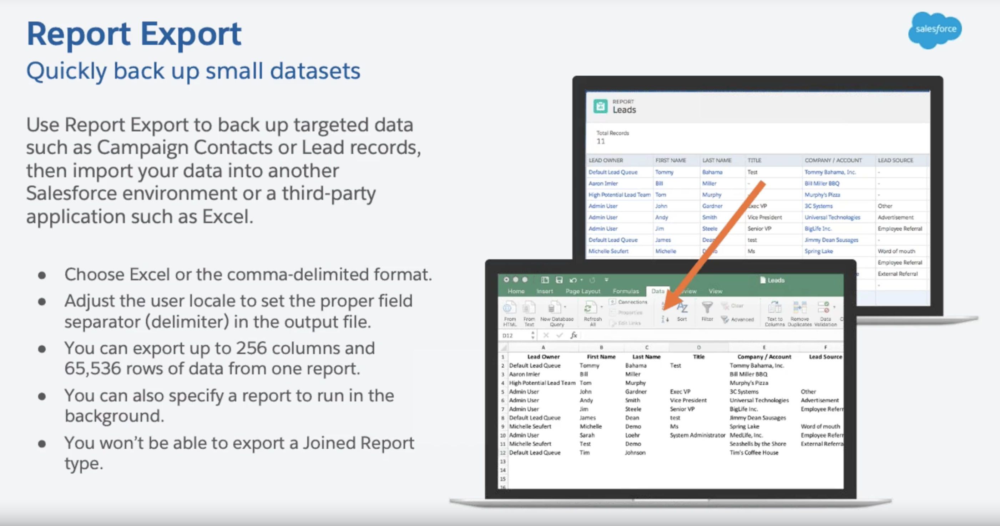

## Native Options for backing up the metadata
- [Change Sets](https://help.salesforce.com/articleView?id=changesets.htm&type=5)
- [Sandbox Refresh](https://help.salesforce.com/articleView?id=data_sandbox_create.htm&type=5)
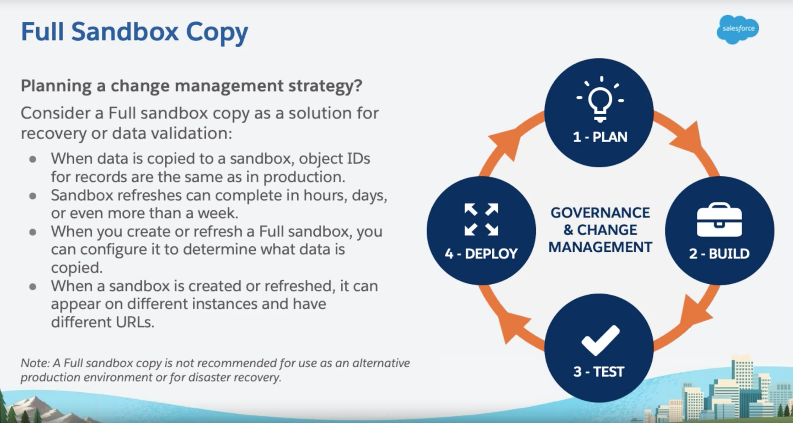
    - Can be refreshed once in 29 days

- API method
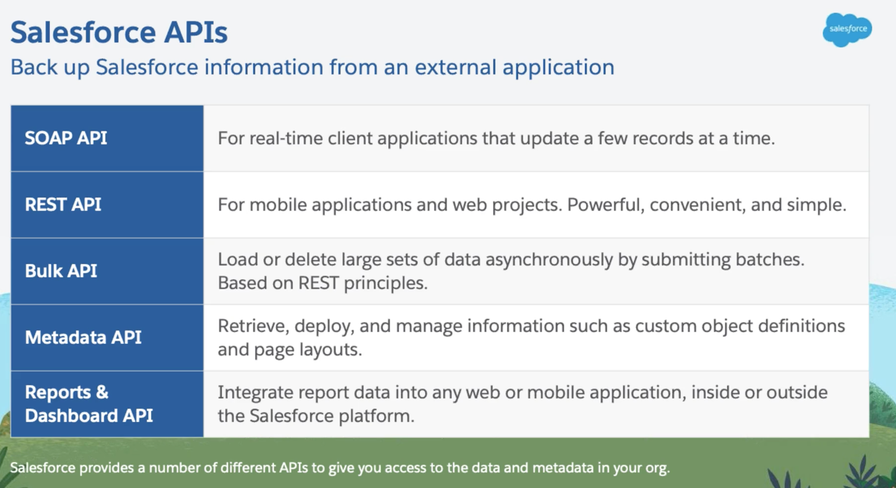

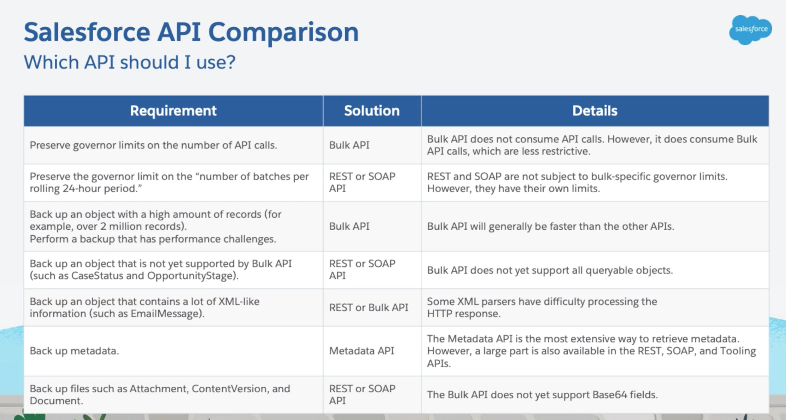

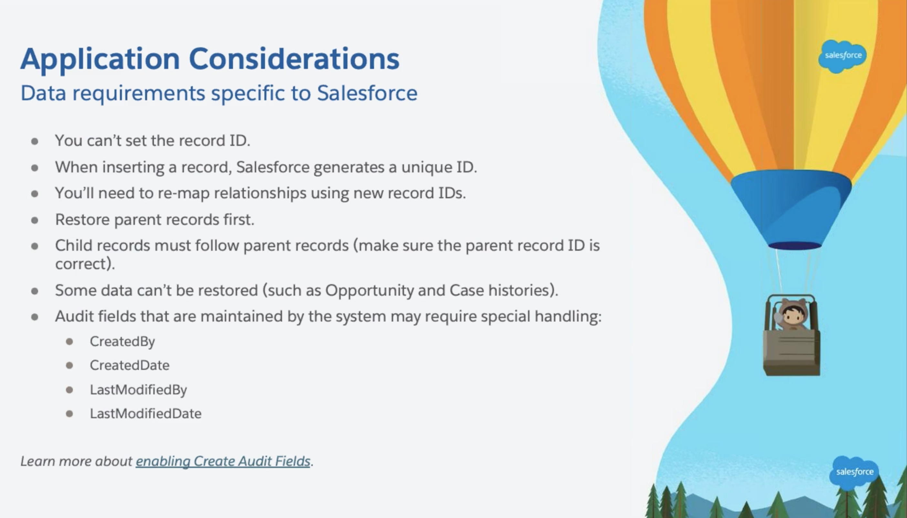

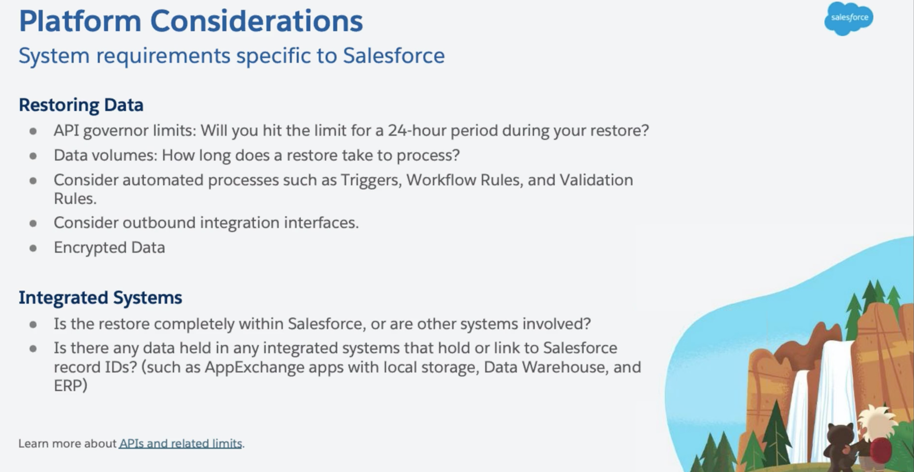


- [Using ANT migration tool](https://developer.salesforce.com/docs/atlas.en-us.daas.meta/daas/forcemigrationtool_install.htm)

## [Third-Party Offerings](https://appexchange.salesforce.com/appxSearchKeywordResults?keywords=backup&searchType=simpleSearch)
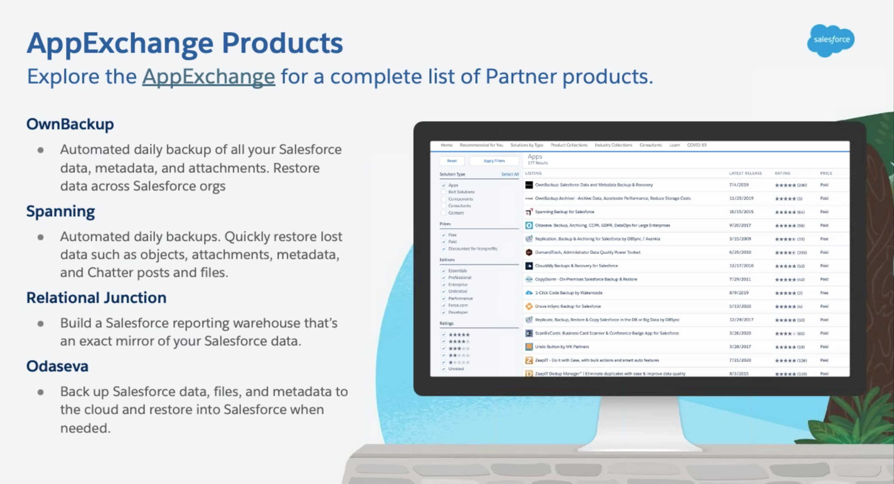
- Helps to automate backups of both your data AND your metadata and provide a mechanism by which to **restore** that data easily.
- Salesforce does not endorse or recommend one specific solution over another.


## Prepare for data restore
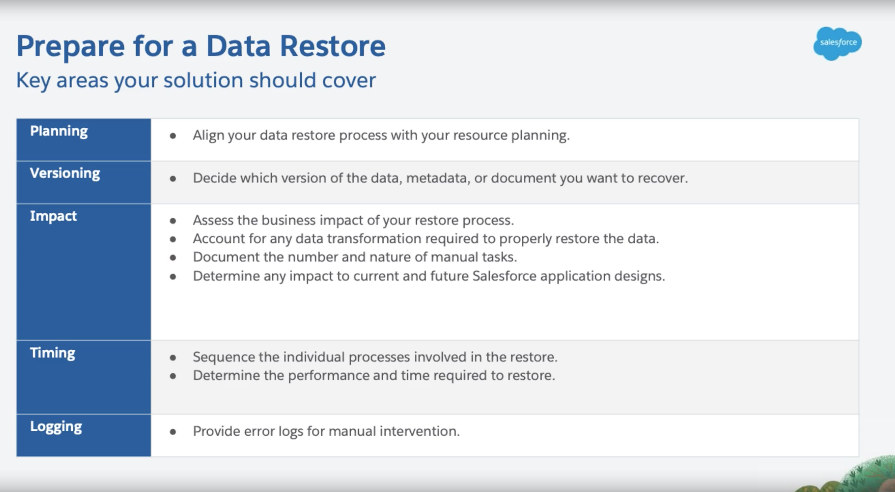


## Resources
- [Best practices to backup Salesforce data](https://help.salesforce.com/articleView?id=000334121&type=1&mode=1)

## Videos
- [How To: Platform: Back Up and Manage Salesforce Data](https://salesforce.vidyard.com/watch/epvXNRWrrPHtto735nS2rh?)
- [Slides](https://org62.my.salesforce.com/sfc/p/#000000000062/a/3y0000003Il7/yKsV5ld_Ysk5O5FRTIrez4Mts6nLYPsDe22xx9qM9Zs)
- [How To: Platform: Back Up and Manage Salesforce Data (Accelerator Webinar)](https://help.salesforce.com/articleView?id=000354893&language=en_US&mode=1&type=1)


## Trailhead
- [Platform: How To Back Up and Manage Salesforce Data](https://trailhead.salesforce.com/users/officialblaze/trailmixes/platform-how-to-backup-and-manage-salesforce-data)
